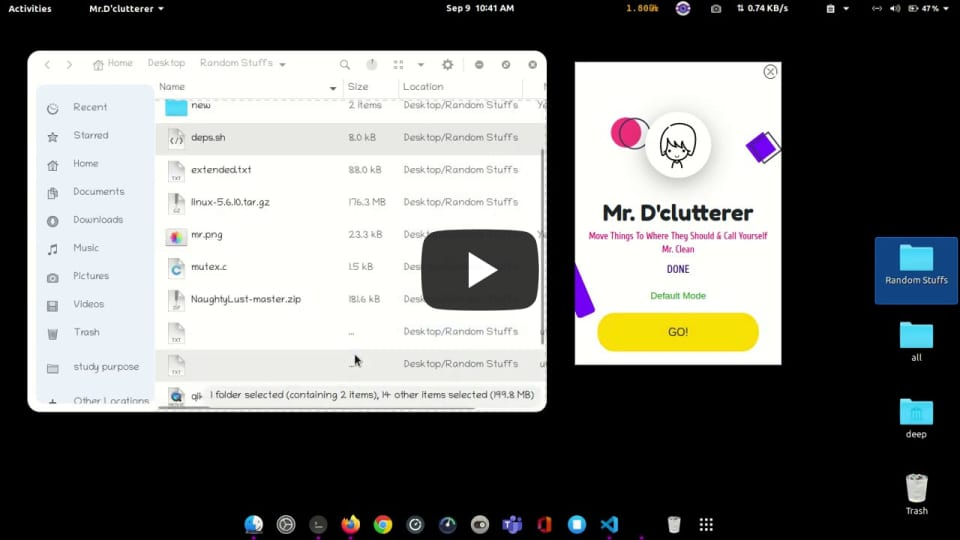

<h2 align=center> Mr. D'clutterer</h2>

 Move files to where they should & call yourself mr. clean 

 Aggregate files . bulk renaming 

 A minimal looking cross-platform desktop application made with <a href="https://electronjs.org"> Electron </a> that handles quick file aggregation and bulk renaming

</img>
</img>

        
              

## About

Are you an internet guy? downloading hundreds of files and then scrolling over all of them to find a few?
Download folder is so cluttered with files that it takes a significant amount of time to open? 
As a programmer want to remove those annoying spaces from file names in bulk? 

Mr.d'clutterer is then going to be a life saver application for you :) simply drop a folder or selected files on to it to make them organized in fraction of a second.

## Features

1. Drag and drop
2. Rename files on-the-fly
3. Aggregate files by extensions and types (more coming soon..) 
4. Process files under sub-directories too
5. Quick access to settings from the right click context-menu :zap:
6. Minimal and beautiful :heart:
7. Auto updates itself
8. Available both for linux & windows

## Download

Download the right installer for your os from [Here](https://github.com/deep5050/Mr.Dclutterer/releases/latest)

## Note

If you are looking for a tiny version of this app without a gui that works right form the file managers' right click menu, check [NaughtyLust](https://github.com/deep5050/NaughtyLust) (Linux Only)

## Demo
 

## Settings Menu

Access settings right from the right click context-menu :cool:

## Usage Guide

### Directory Handling
If any folders (directories) dropped, files under those will also be taken under consideration

### Default Mode

Aggregate files based on their types with directory handling on 

## License
>MIT License

>Copyright (c) 2020 Dipankar Pal

Permission is hereby granted, free of charge, to any person obtaining a copy
of this software and associated documentation files (the "Software"), to deal
in the Software without restriction, including without limitation the rights
to use, copy, modify, merge, publish, distribute, sublicense, and/or sell
copies of the Software, and to permit persons to whom the Software is
furnished to do so, subject to the following conditions:

The above copyright notice and this permission notice shall be included in all
copies or substantial portions of the Software.

THE SOFTWARE IS PROVIDED "AS IS", WITHOUT WARRANTY OF ANY KIND, EXPRESS OR
IMPLIED, INCLUDING BUT NOT LIMITED TO THE WARRANTIES OF MERCHANTABILITY,
FITNESS FOR A PARTICULAR PURPOSE AND NONINFRINGEMENT. IN NO EVENT SHALL THE
AUTHORS OR COPYRIGHT HOLDERS BE LIABLE FOR ANY CLAIM, DAMAGES OR OTHER
LIABILITY, WHETHER IN AN ACTION OF CONTRACT, TORT OR OTHERWISE, ARISING FROM,
OUT OF OR IN CONNECTION WITH THE SOFTWARE OR THE USE OR OTHER DEALINGS IN THE
SOFTWARE.

## Support

All kinds of supports are welcome :raised_hands:! the most basic way to show your support is to star :star2: the project, or to raise issues :speech_balloon: you can also support this project by [**becoming a sponsor on GitHub**](https://github.com/sponsors/deep5050) :clap: Or By Making A [**Paypal**](https://paypal.me/deep5050) Donation :)

## Related Works
[NaughtyLust](https://github.com/deep5050/NaughtyLust) : Awesome Nautilus Scripts For Linux.

[qikQR](https://github.com/deep5050/qikQR) : Minimal QR Code Generator App Made With Electron.

[cppcheck-action](https://github.com/deep5050/cppcheck-action) : Check Security Flaws In Your C/C++ Codes Right From GitHub Action Workflows.

[autopy-lot](https://github.com/deep5050/autopy-lot) : GitHub Action Setup To Convert Jupyter Notebooks To Python Scripts And Markdowns.

Happy Coding

